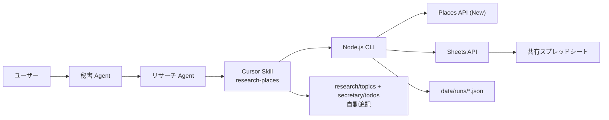

# research-places ツール 設計・運用

## 概要

HPサブスクサービスの初期クライアント獲得（[../../pm/projects/hp-subscription-launch.md](../../pm/projects/hp-subscription-launch.md)）に向け、ケアンズ周辺の飲食店候補をスプレッドシートで継続管理するための自動化ツール。Google Maps Places API の Text Search を使い、エリア × キーワードのシードからヒット店舗を取得して、`place_id` をキーに既存スプレッドシートに追記・更新する。

ツール本体: [../tools/research-places/](../tools/research-places/)

## 設計・方針

### 役割分担



- **CLI (`engineering/tools/research-places`)**: Places 取得・分類・Sheets 同期の責務だけを持つ。ユースケース知識（誰のためにどのリストを更新するか）は持たない。
- **Cursor Skill (`.cursor/skills/research-places`)**: ユーザーの自然文 → CLI 呼び出し → 結果のリサーチ・秘書フォルダへの転記までを担う。CLAUDE.md ルールへの準拠は Skill の責任。
- **リサーチ部署 / 秘書**: ターゲット選定、メール・SNS 補完、DM 送信判断などの人間判断は引き続き Markdown ベースで行う。

### スプレッドシートをマスターデータに

リサーチの「営業先リスト」のマスターはスプレッドシートに置く。Markdown 側（[../../research/topics/cairns-restaurant-prospects.md](../../research/topics/cairns-restaurant-prospects.md)）はサマリと意思決定の記録に役割を分ける。これにより:

- API で常に最新化できる項目（評価・営業状況・電話・ウェブサイト）と、人間が育てる項目（メール・SNS・営業ステータス）を1行に集約できる
- DM 草案・送信履歴を後段（Phase 5+）で同じ行に積みやすい

### 列とデータオーナー

| 列 | オーナー | 上書きルール |
|----|---------|------------|
| `place_id` | CLI（不変） | 常に維持。重複検知のキー |
| `エリア` / `業種` | CLI（初回のみ） | シード由来。手動編集も可 |
| `店名` / `住所` / `電話` / `ウェブサイト` / `HP状態` / `Googleマップ` / `評価` / `レビュー数` / `営業状況` | CLI | API 値で上書き |
| `初回取得日` | CLI（不変） | 行作成時のみ書き込み |
| `最終更新日` | CLI | 値が変わった行のみ更新 |
| `メール` / `SNS` / `営業ステータス` | 人手 | CLI は触らない |

### HP 状態判定ルール

`websiteUri` のホスト名で 3 段階に分類（[../tools/research-places/src/filter.js](../tools/research-places/src/filter.js)）:

- **なし**: `websiteUri` 無し、もしくは Facebook / Instagram / TripAdvisor / Yelp / Uber Eats / Linktr.ee 等の SNS・第三者ディレクトリのみ
- **薄い**: `weeblyte.com` / `wixsite.com` / `sites.google.com` / `business.site` 等の簡易ビルダー
- **独自あり**: 上記以外の独自ドメイン

DM ターゲット判定は `isProspect()`（`なし` または `薄い`）で行う。新しいビルダー系ドメインを発見したら `THIN_BUILDER_HOSTS` に追加する。

### コスト管理

- フィールドマスクで取得項目を限定（[../tools/research-places/src/places.js](../tools/research-places/src/places.js)）
- `MAX_PAGES = 3`、`PAGE_SIZE = 20` で 1 シードあたり最大 60 件
- `--dry-run` で件数とスプレッドシート差分を必ず先に見る
- `data/runs/*.json` に生データを残し、再実行を避ける

## 詳細

### ディレクトリ

```
company_01/engineering/tools/research-places/
├── package.json
├── .env.example
├── .gitignore
├── README.md           ← Phase 0 セットアップ含むユーザー向け手順
├── src/
│   ├── index.js        ← CLI
│   ├── config.js       ← env / SHEET_HEADERS
│   ├── seeds.js        ← エリア×キーワード定義
│   ├── places.js       ← Places API クライアント
│   ├── filter.js       ← HP 状態判定
│   ├── dedupe.js       ← place_id ベースのマージ
│   └── sheets.js       ← Sheets API クライアント
└── data/runs/          ← 取得生データ（gitignore）
```

### CLI サブコマンド

| サブコマンド | 状態 | 用途 |
|------------|------|------|
| `seeds` | 実装済 | シードグループ一覧 |
| `fetch --seed <id> --dry-run` | 実装済 | API は叩く・Sheets には書かない |
| `fetch --seed <id> --apply` | 実装済 | Sheets 反映 |
| `fetch --seed <id> --limit N` | 実装済 | デバッグ用にシード数制限 |
| `sync --apply` | スタブ（Phase 5 で実装） | 既存行のみ最新化 |
| `dm-draft` | 未実装（Phase 5） | 機能 2: 店舗別 DM 草案生成 |
| `outreach` | 未実装（Phase 6） | 機能 3: コンタクト送信補助 |

### シード設計

`seeds.js` でエリア × キーワードを 2 軸に展開。グループ単位で名前付け（例 `cairns-japanese`）し、利用側は ID 一つを指定するだけで済むようにする。新規エリア・キーワードを足すときの判断材料は [../../research/topics/cairns-japan-related-dining.md](../../research/topics/cairns-japan-related-dining.md) のカテゴリ早見を使う。

### 認証方針

- **Places API**: API キー（`X-Goog-Api-Key`）。GCP Console で「Places API (New)」のみに制限する
- **Sheets API**: サービスアカウント。鍵 JSON はローカル保存のみ。スプレッドシートには SA メールを「編集者」で個別共有

OAuth ユーザー認証を採用しない理由:

- CLI を CI / 別マシンから走らせる将来の拡張性
- リサーチ Agent から自動起動する用途で、対話フロー（ブラウザ認可）を挟みたくない

### スプレッドシートのヘッダー検証

`sheets.js` は書き込み前に 1 行目を `SHEET_HEADERS` と完全一致でチェックする。手動で列順を変えると停止し、エラーで原因を提示するのでデータ破損を防げる。新列を足す場合は:

1. `config.js` の `SHEET_HEADERS` に追加
2. `dedupe.js` の `HUMAN_OWNED` を更新（人手列の場合）
3. 既存スプレッドシートの 1 行目を手動で揃える

### 失敗モード

| 症状 | 原因 / 対処 |
|------|----------|
| `Missing required env var` | `.env` 不足 → README Phase 0 |
| `Places searchText failed: 403` | API 制限・課金未有効 |
| `Places searchText failed: 429` | レート制限 → `--limit` で縮小 |
| `permission denied` (Sheets) | サービスアカウントを編集者で共有していない |
| ヘッダー不整合 | スプレッドシート 1 行目を `SHEET_HEADERS` と合わせる |

## Phase 5 以降の拡張ロードマップ

機能 2（店舗別 DM 草案生成）と機能 3（コンタクト送信）を、本ツールの **同一 CLI / 同一スプレッドシート** に積む方針。新規プロジェクトを起こさず、列追加で表現する。

### 機能 2: `dm-draft` サブコマンド

```bash
node src/index.js dm-draft --where "HP状態 in (なし, 薄い) and 営業ステータス = 未送付"
```

- **入力**: スプレッドシートから対象行を抽出
- **生成**: 店名 / 業種 / エリア / 既存 SNS から、Claude / OpenAI API で店舗別 DM を作成
- **出力列（追加予定）**: `DM下書き` / `DM生成日` / `DMチャンネル候補`
- **承認フロー**: 一旦下書き列に書き込むだけ。送信は別サブコマンド or 人手

### 機能 3: `outreach` サブコマンド

```bash
node src/index.js outreach --row <place_id> --channel email
node src/index.js outreach --row <place_id> --channel instagram
```

- **メール**: Gmail API か SMTP（要追加 OAuth）
- **Instagram / Facebook**: 公式 DM API は限定的。クリップボードコピー + ブラウザ起動で半自動化を想定
- **ログ列（追加予定）**: `DM送信日` / `DMチャンネル` / `返信状況` / `次アクション期限`

### 機能横断の運用ルール

- DM 送信は必ずスプレッドシートに記録 → `cairns-restaurant-prospects.md` の営業進捗テーブルへ Skill が転記
- 既存の Ganbaranba / Kushi / CAFE TOKYO 案件は手動入力で行を起こす（`place_id` は手書き or `places fetch` 実行で自動補完）

## 再発防止 / 学び

- 既存の手動リスト運用（[../../research/topics/cairns-restaurant-prospects.md](../../research/topics/cairns-restaurant-prospects.md)）が成熟してから自動化に移行することで、列設計が現実の営業フローに即した形に落ちている
- スプレッドシートをマスター化する判断は、DM 草案・送信ログまで一貫させることが目的。Markdown はあくまで意思決定とサマリのレイヤーに残す
